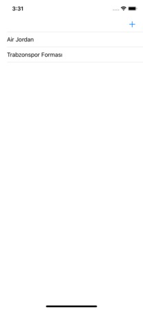
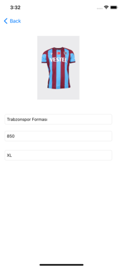
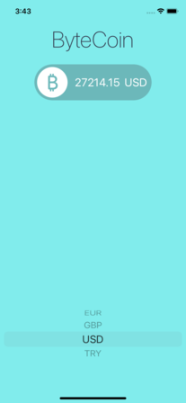
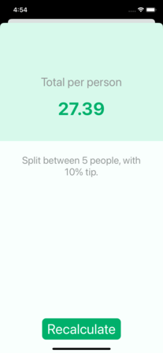
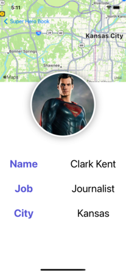

<h1 align="center">AR Ruler</h1>
<h3>A ruler app that works with Augmented Reality.</h3>

    

---

<h1 align="center">AR Dicee</h1>
<h3>The app to shake the dice with Augmented Reality.</h3>

    

---

<h1 align="center">Alisveris Listesi</h1>
<h3>The app to save products with photos, prices and sizes for later purchase using Core Data.</h3>

    
    

---

<h1 align="center">BMI Calculator</h1>
<h3>The app that calculates BMI.</h3>

    
    

---
<h1 align="center">Byte Coin</h1>
<h3>The application that gets the instant value of Bitcoin with api and presents it to the user with different currencies.</h3>

    

---
<h1 align="center">Alisveris Listesi</h1>
<h3>The app to save products with photos, prices and sizes for later purchase using Core Data</h3>

    
    

---
<h1 align="center">Clima</h1>
<h3>It gives the weather information at the instant location with GPS or the searched location. Background image changes in dark and light mode and icons change according to the weather.</h3>

    
    

---
<h1 align="center">Egg Timer</h1>
<h3>A Time keeping app for boiling eggs. Tap the egg image how you like and the alarm will sound after the required time has elapsed.</h3>

    

---
<h1 align="center">Flash Chat</h1>
<h3>Messaging app that keeps messages and users in Firebase</h3>

    
    

---
<h1 align="center">Magic 8 Ball</h1>
<h3>Magic Eight Ball App</h3>

    

---
<h1 align="center">Tipsy</h1>
<h3>The application that makes it easy to split the price per person.</h3>

    
    

---
<h1 align="center">Super Hero Book</h1>
<h3>In this application made using Swift UI, superheroes are shown in the list. When you click on the superhero, the superhero's name, profession, city name are displayed. Also the city is shown on the map.</h3>

    
    

---

<h1 align="center">Emir Card</h1>
<h3>Simple personal card made by Swift UI.</h3>

    

---
<h1 align="center">Movie Search</h1>
<h3>Simple personal card made by Swift UI.</h3>

    
    

